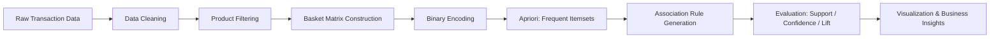
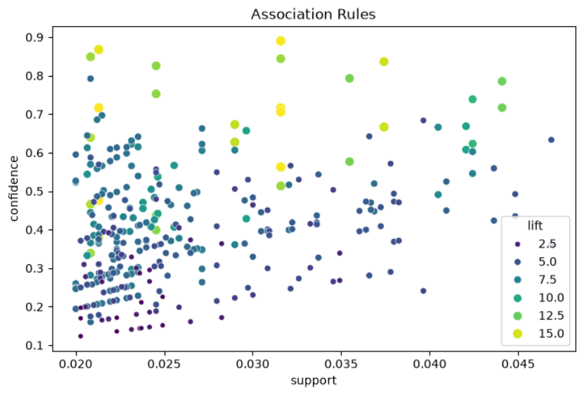

#  E-Commerce Market Basket Analysis using the Apriori Algorithm


> Discovering hidden purchasing patterns in ~500,000 e-commerce transactions using frequent itemset mining and association rule generation.

---

##  Table of Contents

- [Project Overview](#-project-overview)
- [Problem Statement](#-problem-statement)
- [Dataset](#-dataset)
- [Workflow](#-workflow)
- [Data Preprocessing](#-data-preprocessing)
- [Transaction Basket Construction](#-transaction-basket-construction)
- [Frequent Itemset Mining](#-frequent-itemset-mining)
- [Association Rule Generation](#-association-rule-generation)
- [Evaluation Metrics](#-evaluation-metrics)
- [Results & Visualization](#-results--visualization)
- [Business Applications](#-business-applications)
- [Key Challenges](#-key-challenges)
- [Technologies Used](#-technologies-used)
- [Project Structure](#-project-structure)
- [How to Run](#-how-to-run)
- [Conclusion](#-conclusion)
- [Author](#-author)

---

##  Project Overview

**Market Basket Analysis (MBA)** is a data mining technique that uncovers relationships between products frequently purchased together. This project applies the **Apriori Algorithm** to a large-scale e-commerce transaction dataset (~**500,000 records**) to extract frequent product combinations and generate actionable association rules.

The insights produced support real business decisions, including:

| Application | Description |
|---|---|
|  Product Bundling | Combine frequently co-purchased items into promotional bundles |
|  Cross-Selling | Power "customers also bought" recommendation engines |
|  Personalized Marketing | Target customers based on purchase associations |
|  Inventory Planning | Anticipate correlated demand across products |
| 🏭 Warehouse Optimization | Store associated products closer together to reduce picking time |

The project follows a complete, end-to-end data mining pipeline — from raw transactional data to business-ready recommendations.

---

##  Problem Statement

E-commerce datasets typically store purchases as individual line items, one row per product per invoice:

| InvoiceNo | Description | Quantity |
|---|---|---|
| 10001 | Product A | 2 |
| 10001 | Product B | 1 |
| 10002 | Product A | 1 |
| 10002 | Product C | 3 |

While every purchase is recorded, the **relationships between products are invisible** in this raw format. This project restructures the data to answer questions such as:

> *"Customers who purchase Product A are also likely to purchase Product B."*

---

##  Dataset

**Source:** [E-Commerce Data — Kaggle](https://www.kaggle.com/datasets/carrie1/ecommerce-data)

### Characteristics
- ~500,000 transaction records
- Thousands of unique products
- Multiple customers across several countries

### Key Features

| Feature | Description |
|---|---|
| `InvoiceNo` | Unique transaction/invoice identifier |
| `StockCode` | Product identification code |
| `Description` | Product name |
| `Quantity` | Units purchased |
| `InvoiceDate` | Date and time of transaction |
| `UnitPrice` | Price per unit |
| `CustomerID` | Unique customer identifier |
| `Country` | Customer's country |

---

## 🔄 Workflow



---

## 🧹 Data Preprocessing

### 1. Handling Missing Values
Rows missing `CustomerID` or `Description` are dropped, since both are essential for identifying valid customers and products.

```python
df = df.dropna(subset=['CustomerID', 'Description'])
```

### 2. Removing Cancelled Transactions
Invoices prefixed with `C` represent cancellations and are excluded, as they don't reflect completed purchases.

```python
df['InvoiceNo'] = df['InvoiceNo'].astype(str)
df = df[~df['InvoiceNo'].str.startswith('C')]
```

### 3. Removing Invalid Quantities
Transactions with zero or negative quantities are removed to keep the analysis focused on actual purchases.

```python
df = df[df['Quantity'] > 0]
```

### 4. Product Filtering for Performance
With thousands of unique products, running Apriori on the full catalog would be computationally infeasible. The analysis is scoped to the **top 100 most frequently purchased products**, preserving dominant patterns while keeping the itemset space manageable.

```python
top_products = df['Description'].value_counts().head(100).index
df_filtered = df[df['Description'].isin(top_products)]
```

---

## 🧺 Transaction Basket Construction

Transactions are grouped by `InvoiceNo` and `Description`, then pivoted into a basket matrix — one row per invoice, one column per product.

```python
basket = (
    df_filtered[df_filtered['Country'] == 'United Kingdom']
    .groupby(['InvoiceNo', 'Description'])['Quantity']
    .sum()
    .unstack()
    .fillna(0)
)
```

| InvoiceNo | Product A | Product B | Product C |
|---|---|---|---|
| 10001 | 2 | 1 | 0 |
| 10002 | 1 | 0 | 3 |

**Binary encoding** converts purchase quantities into presence/absence flags, and the matrix is cast to boolean values as required by `mlxtend`:

```python
basket_sets = basket.map(lambda x: 1 if x > 0 else 0)
basket_sets = basket_sets.astype(bool)
```

**Transaction filtering** removes single-item baskets, since they carry no co-purchase information:

```python
basket_sets = basket_sets[basket_sets.sum(axis=1) >= 2]
```

---

## ⛏️ Frequent Itemset Mining

Frequent itemsets are mined with the `mlxtend` implementation of Apriori:

```python
from mlxtend.frequent_patterns import apriori, association_rules

frequent_itemsets = apriori(
    basket_sets,
    min_support=0.02,
    use_colnames=True,
    low_memory=True,
    max_len=3
)

frequent_itemsets = frequent_itemsets.sort_values(by='support', ascending=False)
```

### Configuration Rationale

| Parameter | Value | Purpose |
|---|---|---|
| `min_support` | `0.02` | Filters out rare, statistically insignificant combinations |
| `use_colnames` | `True` | Returns readable product names instead of column indices |
| `low_memory` | `True` | Reduces memory footprint during candidate generation |
| `max_len` | `3` | Caps itemset size to control combinatorial growth |

These settings balance **pattern discovery** against the **computational cost** of mining a 500K-row dataset.

---

## 🔗 Association Rule Generation

Rules are derived from the frequent itemsets, filtered by a minimum lift threshold:

```python
rules = association_rules(
    frequent_itemsets,
    metric='lift',
    min_threshold=1.0
)
```

Each rule follows the form:

```
Product A → Product B
```

interpreted as: *customers who buy Product A are also likely to buy Product B.*

---

## 📐 Evaluation Metrics

| Metric | Formula | Interpretation |
|---|---|---|
| **Support** | `Support(A) = Transactions containing A / Total transactions` | How frequently an itemset appears overall |
| **Confidence** | `Confidence(A→B) = Support(A ∩ B) / Support(A)` | Probability of buying B given A was bought |
| **Lift** | `Lift(A→B) = Confidence(A→B) / Support(B)` | Strength of association relative to chance |

**Lift interpretation:**
- `Lift > 1` → positive association
- `Lift = 1` → no meaningful association
- `Lift < 1` → negative association

Rules are ranked using a combination of these three metrics, since high confidence alone can be misleading for low-support (rare) itemsets.

```python
rules = rules.sort_values(by='lift', ascending=False)
rules.head(10)
```

---

## 📈 Results & Visualization

The relationship between Support, Confidence, and Lift is visualized as a scatter plot, where:

- **X-axis** → Support
- **Y-axis** → Confidence
- **Point size / color intensity** → Lift

This highlights rules that combine strong association, high confidence, and meaningful frequency.

<p align="center">
  
</p>

---

## 💼 Business Applications

<table>
<tr><td width="20%"><b>🎁 Product Bundling</b></td><td>Bundle high-lift product pairs at a discount to increase Average Order Value.</td></tr>
<tr><td><b>🔁 Cross-Selling</b></td><td>Power "customers who bought this also bought…" widgets on product, cart, and checkout pages.</td></tr>
<tr><td><b>📣 Personalized Marketing</b></td><td>Target customers with recommendations based on prior purchases and strong associations.</td></tr>
<tr><td><b>📦 Inventory Planning</b></td><td>Anticipate correlated demand between associated products for smarter stock planning.</td></tr>
<tr><td><b>🏭 Warehouse Optimization</b></td><td>Position frequently co-purchased items closer together to reduce picking time.</td></tr>
</table>

---

## ⚠️ Key Challenges

Applying Apriori at this scale surfaced several performance considerations:

- Combinatorial explosion of candidate itemsets as product count grows
- Memory overhead when generating and storing frequent itemsets
- Balancing minimum support thresholds against pattern richness

**Mitigations applied:**
- ✅ Restricted analysis to the top 100 most frequent products
- ✅ Removed cancelled and invalid transactions upfront
- ✅ Filtered out single-item baskets
- ✅ Used a higher `min_support` threshold
- ✅ Enabled `low_memory=True`
- ✅ Capped itemset length with `max_len=3`

---

## 🛠️ Technologies Used

| Category | Tools |
|---|---|
| Language | Python |
| Data Handling | Pandas, NumPy |
| Visualization | Matplotlib, Seaborn |
| Association Rule Mining | Mlxtend |
| Environment | Jupyter Notebook |

---

## 📁 Project Structure

```
ecommerce-market-basket-analysis/
│
├── data/
│   └── ecommerce_data.csv
├── images/
│   └── association_rules_plot.png
├── notebooks/
│   └── market_basket_analysis.ipynb
├── README.md
└── requirements.txt
```

---

## ▶️ How to Run

```bash
# 1. Clone the repository
git clone https://github.com/khaled-amireh/ecommerce-market-basket-analysis.git
cd ecommerce-market-basket-analysis

# 2. Install dependencies
pip install -r requirements.txt

# 3. Launch the notebook
jupyter notebook notebooks/market_basket_analysis.ipynb
```

---

## ✅ Conclusion

This project demonstrates a complete data mining pipeline that transforms raw e-commerce transactions into actionable business insight:

1. Clean and validate transaction records
2. Remove cancelled and invalid purchases
3. Reduce the product search space
4. Construct a transaction basket matrix
5. Apply binary encoding
6. Filter for meaningful co-purchase behavior
7. Mine frequent itemsets with Apriori
8. Generate association rules
9. Evaluate rules using Support, Confidence, and Lift
10. Visualize product relationships
11. Translate patterns into business recommendations

Beyond the algorithm itself, the project highlights a critical real-world lesson in data mining: **performance and memory constraints must be actively managed** when working with large-scale transactional data.

---

## 👤 Author

**Khaled Amireh**
[GitHub](https://github.com/khaled-amireh)
